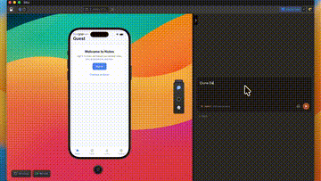
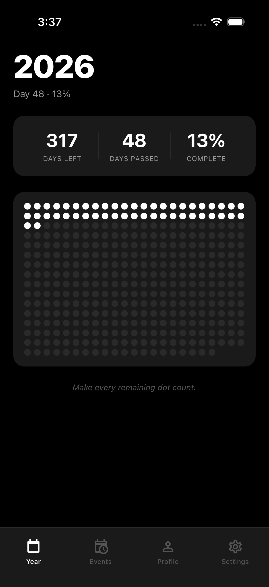
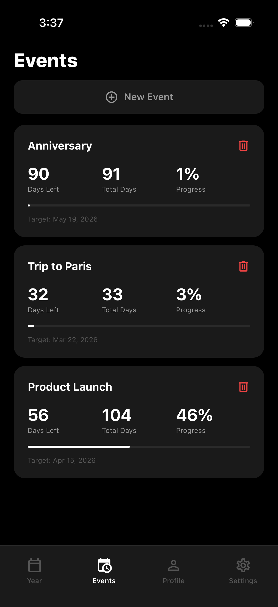
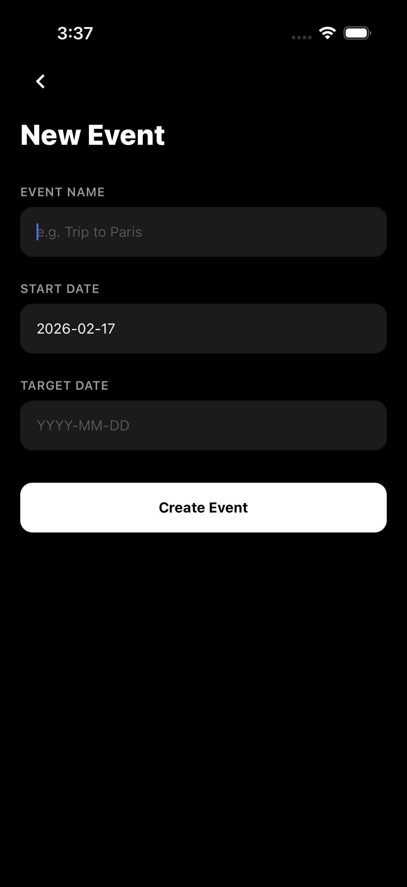

# Dale Clone

A minimalist year-in-progress tracker and event countdown app. Visualize the passing year as a dot grid and track days remaining until the events that matter to you.

Built with React Native, Vite, and Cloudflare Workers.

<p align="center">
  
</p>

<p align="center">
  
  
  
</p>

## Features

- **Year view** — dot grid showing days passed and remaining, with stats at a glance
- **Event countdowns** — track days left, total duration, and progress percentage for any event
- **Dark / light mode** — follows system preference
- **Auth** — sign up, log in, or continue as guest
- **Cloudflare backend** — D1 database, R2 storage, Workers API via [Teenybase](https://github.com/nicholasareed/teenybase)

## Setup

```bash
npm install
```

Copy `sample.vars` to `.dev.vars` and fill in your secrets.

```bash
# frontend
npm run dev

# backend
npm run dev:backend
```

## Tech Stack

| Layer | Tech |
|---|---|
| Frontend | React Native, React Native Web, Vite |
| Backend | Cloudflare Workers, D1, R2 |
| ORM / API | Teenybase |
